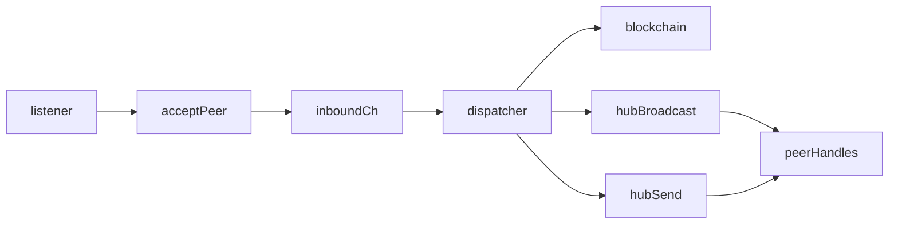

# NetworkHub Refactor Plan

## Goals

- Add `Envelope` framing utilities mirroring `Message::send/receive` to keep wire format unchanged.
- Introduce a `NetworkHub` that owns peer handles, channels, and a seen-cache; NodeContext holds it.
- Move message dispatching into a dedicated loop; handler becomes accept-only I/O; main spawns dispatcher once.

## Steps

- **Envelope utilities**: In [`lib/src/network.rs`](/Users/edujlac/Documents/RustBoot/grapheno/lib/src/network.rs), add `Envelope` struct with encode/decode/send/receive and async variants, reusing existing framing logic.
- **NetworkHub & peers**: In `node` crate (new module/file), define `NetworkHub` managing `mpsc` channels (inbound/outbound), `PeerHandle` wrappers, and a seen-cache (HashSet keyed by tx/block hash or UUID). Provide `broadcast_except` and `send_to` APIs using try_send for gossip.
- **Context update**: Update [`node/src/context.rs`](/Users/edujlac/Documents/RustBoot/grapheno/node/src/context.rs) so `NodeContext` holds `Arc<NetworkHub>` instead of `DashMap<String, Arc<Mutex<TcpStream>>>`; adjust initialization to populate peers via `populate_connections` and register with the hub.
- **Accept path**: Replace `handle_connection` with `accept_peer` in [`node/src/handler.rs`](/Users/edujlac/Documents/RustBoot/grapheno/node/src/handler.rs) to perform only socket I/O → `Envelope` and send inbound messages into the hub; outbound uses hub channels.
- **Dispatcher loop**: Add `dispatcher_loop` in the hub or a new module that receives inbound `Message`s, runs the existing `match Message { ... }` logic from `handler.rs`, and uses `broadcast_except`/`send_to` instead of direct socket writes.
- **Main wiring**: Update [`node/src/main.rs`](/Users/edujlac/Documents/RustBoot/grapheno/node/src/main.rs) to spawn the dispatcher once, and accept peers by passing sockets to the hub/acceptor.

## Notes

- Use `send().await` for inbound/backpressure-safe paths; use `try_send` for outbound gossip to avoid slow peers blocking the swarm.
- Keep wire format identical; only routing/ownership changes.
- Seed/discovery flows (`DiscoverNodes`, etc.) routed through the dispatcher; hub methods wrap all network writes.

## Mermaid Sketch

